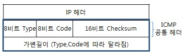

# ICMP
*Internet Control Message Protocol*  

 

ICMP는 IP 패킷을 처리할 때 발생되는 문제를 진단하고 파악하는 역활을 한다. IPv4를 위한 ICMPv4와 IPv6를 위한 ICMPv6로 나눌 수 있다. 이 둘의 
차이는 IP의 헤더 차이이다.  

## ICMP 메시지 포멧

 
ICMP 메시지는 다음과 같이 8비트의 타입과 8비트의 코드 그리고 16비트의 체크섬으로 이루어져있다. 

## ICMPv4

> 대표적인 ICMPv4 타입 코드

* ###  0 Echo Reply
* * 0 Echo reply : 에코 응답
* ### 3 Destination Unreachable
* * 0 Network Unreachable : 수신지 네트워크에 도달할 수 없음
* * 1 Host unreachable : 수신지 호스트에 도달할 수 없음
* * 2 Protocol unreachable : 프로토콜에 도달할 수 없음
* * 3 Port unreachable : 포트에 도달할 수 없다.
* * 4 Fragmentation needed but DF bit set : 프래그멘테이션이 필요하나, DF 비트가 True 이기에 할 수 없다.
* * 5 Source route failed : 소스 경로를 알 수 없음
* * 6 Network unknown : 수신지 네트워크 알 수 없음
* * 7 Host unknown : 수신지 호스트를 알 수 없음
* * 9 Destination network administratively prohibited : 수신지 네트워크에 대해 통신이 관리적으로 거부되어 있음
* * 10 Destination host administratively prohibited : 수신지 호스트에 대한 통신이 관리적으로 거부퇴어 있음
* * 11 Network unreachable for ToS : 지정한 ToS 값에서는 수신지 네트워크에 도달할 수 없음
* * 12 Host unreachable for ToS : 지정한 ToS 값에서는 수신지 네트워크에 도달할 수 없음
* * 13 Communication administratively prohibited by filtering : 필터링에 의한 통신이 관리적으로 금지되어 있음
* * 14 Host precedence violation : 프레시던스 값이 위반되어 있음
* * 15 Precedence cutoff in effect : 프레시던스 값이 너무 낮아서 차단됨
* ### 5 Redirect 
* * Redirect for network : 수신지 네트워크에 대한 통신을 지정된 IP 주소에 전송
* * Redirect for host : 수신지 호스트에 대한 통신을 지정된 IP 주소에 전송
* * Redirect for ToS and network : 수신지 네트워크와 ToS 값의 통신을 지정된 IP 주소로 전송
* * Redirect for ToS and host : 수신지 호스트와 ToS 값의 통신을 지정된 IP 주소로 전송
* ### 8 Echo Request
* * 0 Echo Request : 에코 요청
* ### Time exceeded
* * 0 Time to live exceeded in transit : TTL이 초과함.

### 에코 요청/응답
IP 레벨의 통신 상태를 확인할 때 사용되는 ICMPv4 패킿ㅅ이 에코 요청과 에코 응답이다. ping 명령어를 실행하면 지정한 IP 주소에 대해 타입이 '8', 코드가 '0'인 
에코 요청을 송신한다. 에코 요청을 받은 단말은 그 응답으로 타입이 '0', 코드가 '0'인 에코 응답을 반환한다.  

### Destination Unreachable
IPv4 패킷을 수신지 IPv4 주소의 단말까지 라우팅하지 못했을 때, 에러를 알리는 ICMPv4 패킷이 Destination Unreachable(수신지 도달 불가)이다.  

### Time-to-live exceeded
IPv4 패킷의 TTL이 '0'이 되어 파기했을 때, 그것을 송신지 단말에게 알리는 패킷이 Time-to-live exceeded이다. TTL exceeded는 라우팅 루프 방지와
통신 경로 확인이라는 2가지 역할을 담당한다.

#### 라우팅 루프 방지
라우팅 설정 실수에 의해 IP 패킷이 여러 라우터를 통해 빙글빙그 도는 현상을 **라우팅 루프**라고 한다. 이더넷이나 무선 LAN은 루프를 감지하기 못하기 때문에 한번 루프되면 
멈추지 않고 계속 핑퐁된다. 이를 막기위해 TTL을 설정하고, TTL이 1이 되면 그 패킷은 파기한다. 

#### 통신 경로 확인
TTL Exceeded의 동작을 응용해서 통신 경로를 확인 하는 프로그램이 traceroute (tracert)이다. traceroute는 TTL을 '1'에서 시작해서
하나씩 증가하면서 패킷이 어느 경로로 왔는지 확인하는 것이다. 

## ICMPv6

ICMPv6은 ICMPc4가 가진 기능에 더해, MAC 주소를 학습하는 기능이나 주소 중복을 감지하는 기능, 네트워크 정보를 제공하는 기능 등이 있어 한층 중요한 역할을 
담당한다.  

> 대표적인 ICMPv6의 동작

### IPv6 주소 중복 감지

### 수신지 IPv6 주소에서 수신지 MAC 주소 구하기

### 네트워크 정보 제공
